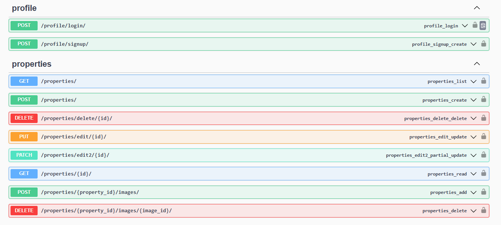

# Property Rental Management System
### Description: Build a Django backend for a property rental platform where landlords can list their properties, tenants can browse listings and book properties, and both parties can manage their rental agreements, payments, and reviews.

## ---------------------------------------------------------
# Setup
#### Create a new directory
#### Change to this directory
#### Clone  this Repo to the current directory
- `git clone https://github.com/M7mmed-Sayed/Property-Rental-Management-System.git`

#### Set up a virtual environment and activate it at Windows open ``` terminal ``` and write the following commands:
1. `python -m pip install virtualenv`
2. `python -m virtualenv venv`
3. `venv\scripts\activate`
4. `pip3 install -r requirements.txt`  to install required packages 
5. `py manage.py runserver 8000`  Run the server  

## ---------------------------------------------------------
## what it do ?
- user can sign in/up
- Landlord can add his properties 
- and can search in amenities and assign a list of amenities to this property 
- Landlord can attach/remove images to/from the property and add a caption for each one 
- Tenant can search with range price (min-max) to find properties with his expectations price  
- Tenant can search with location and expectation distance range , like the client (web, APK) `longitude, latitude` and desired distance range 

## what will it do? 
- tenant requests to take a property from the desired start date with the desired number of num-nights if and only if this segment isn't booked  
- Send notification for the  Property Owner /Landlord `tenant "name" requested to use your property ` 
- The landlord has the right to Accept/Confirm or cancel this requests 
- If the Landlord Confirms the request, we send a notification to the tenant that `your request has been approved and you have (e.g 8 hours) to pay for this or your request will be canceled` 
- If the payment is made, his request will be saved and NoOne even the Landlord can cancel or remove this request 
- After finishing his nights at this property it will be added to the history table, improving search  optimization for new requests
- Tenant will pay over PayPal
- Tenant can search for his renting history/payments
- Tenant can add a Review after finishing using the property 
- The landlord can rating Tenant , Cleaning ,Respect,....etc , it's will be useful for the other landlord
# APIs

